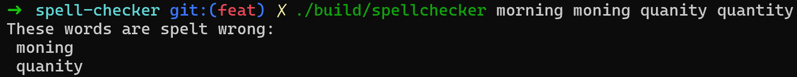

# Spell Checker

A spell checker using Bloom filter.

## Demo



## Run Locally

Clone the project

```bash
git clone git@github.com:tlphat/spell-checker.git
```

Navigate to the directory

```bash
cd spell-checker
```

Assign executing permission of build script

```bash
chmod +x ./build.sh
```

Build the executable file

```bash
./build.sh
```

Run the executable file

```
./build/spellchecker [word list...]
```


## Implementation Details

The Unix-based word dictionary (235,976 words) is used. 
To achieve 0.01% false positive rate, the bit array size is chosen to be 4.6M and the number of hash functions is chosen to be 17.

We rely on FNV-1 (Fowler-Noll-Vo) hashing algorithm because it's very simple to implement.
For each hash function, we choose an arbitrary pair of offset and prime to vary the output.

As a result, we compressed the original dictionary by 4 times (from ~ 2.5 MB to ~ 575 KB), while still being able to provide fast spellchecking with only 0.01% of false positive.

## Reference

- [Bloom filter - Wikipedia](https://en.wikipedia.org/wiki/Bloom_filter)
- [Fowler–Noll–Vo hash function](https://en.wikipedia.org/wiki/Fowler%E2%80%93Noll%E2%80%93Vo_hash_function)